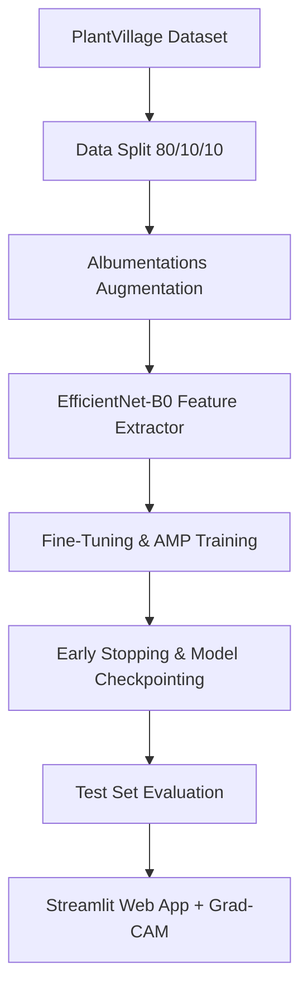
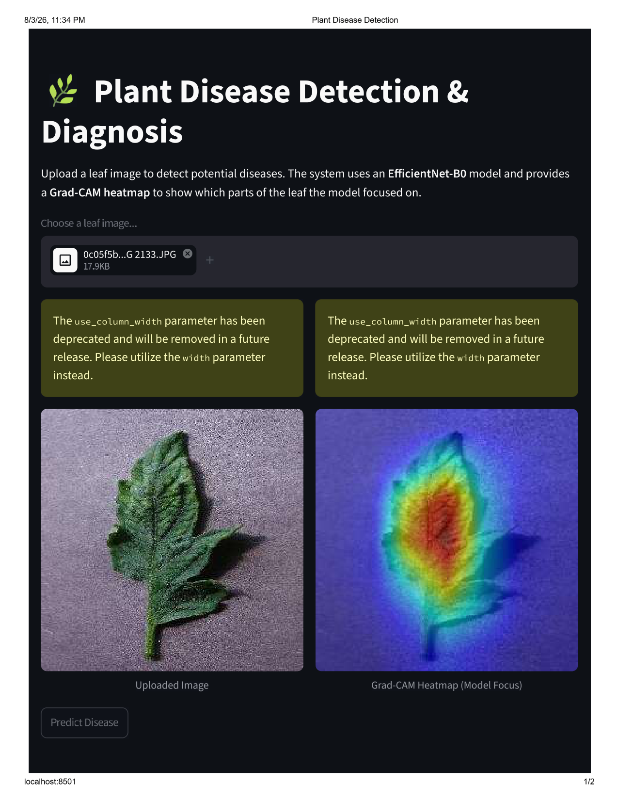

<div align="center">
  
# 🌿 Plant Disease Detection System
**An End-to-End Deep Learning Pipeline for Diagnosing Plant Health using Computer Vision**

[](https://www.python.org/)
[](https://pytorch.org/)
[](https://streamlit.io/)
[](https://opensource.org/licenses/MIT)
[](https://github.com/yourusername/plant-disease-detection/stargazers)

</div>

---

## 📖 Project Overview
Agricultural crop diseases lead to massive yield losses globally. This project presents a robust, end-to-end **Deep Learning solution** to automatically detect and classify **38 different plant diseases** from leaf images. 

Leveraging **Transfer Learning** with an **EfficientNet-B0** architecture, the model is designed to be highly accurate while remaining computationally efficient. A user-friendly **Streamlit** frontend is provided for seamless inference, alongside **Grad-CAM** visualizations to ensure the model's predictions are explainable and trustworthy.

---

## ✨ Key Features
- **State-of-the-Art Architecture**: Uses ImageNet-pretrained `EfficientNet-B0` for excellent accuracy-to-compute ratio.
- **Explainable AI (XAI)**: Integrated `Grad-CAM` to highlight the exact diseased regions on the leaf that triggered the model's prediction.
- **Optimized Training Pipeline**: Employs Mixed Precision Training (AMP), AdamW optimizer, and `ReduceLROnPlateau` scheduling.
- **Automated Early Stopping**: Prevents overfitting by monitoring Validation F1-Score.
- **Interactive Web App**: Fully deployed locally via a sleek Streamlit interface.
- **Robust Data Augmentation**: Utilizes `Albumentations` for advanced image transformations.

---

## 📸 Demo
<div align="center">
  
  <br>
  <em>(Replace with actual demo GIF/Screenshot)</em>
</div>

---

## 🧠 Project Architecture & Workflow

### Development Pipeline


---

## 📂 Folder Structure

<details>
<summary>Click to expand</summary>

```text
Plant_Disease_Detection/
├── checkpoints/          # Saved best model weights (.pth)
├── data/                 # Raw and processed datasets
├── logs/                 # TensorBoard logs & confusion matrix plot
├── src/                  # Core modules
│   ├── config.py         # Global Hyperparameters & paths
│   ├── dataset.py        # PyTorch dataset & dataloaders
│   ├── evaluate.py       # Metrics & confusion matrix logic
│   ├── gradcam.py        # Grad-CAM explainability module
│   ├── model.py          # EfficientNet-B0 architecture setup
│   ├── predict.py        # Inference pipeline
│   ├── trainer.py        # Training & validation loop orchestrator
│   ├── transforms.py     # Data augmentation pipelines
│   └── utils.py          # Helper functions (seeds, loggers)
├── .gitignore            # Ignored files/directories
├── app.py                # Streamlit Web App entry point
├── README.md             # Project documentation
├── requirements.txt      # Python dependencies
├── scripts/              # Utility scripts
│   └── prepare_data.py   # Dataset downloader & splitter
└── train.py              # Main training execution script
```
</details>

---

## 🛠️ Technologies Used
- **Deep Learning**: PyTorch, Torchvision
- **Computer Vision**: OpenCV, Albumentations
- **Web Deployment**: Streamlit
- **Data Manipulation**: NumPy, Pandas, Scikit-Learn
- **Visualization**: Matplotlib, TensorBoard

---

## 📊 Dataset Information
- **Name**: [PlantVillage Dataset](https://www.kaggle.com/datasets/emmarex/plantdisease)
- **Total Classes**: 38 (Includes Apple, Corn, Grape, Potato, Tomato, and more)
- **Split Ratio**: 
  - 80% Training
  - 10% Validation
  - 10% Testing

---

## 🚀 Installation Guide

1. **Clone the repository:**
   ```bash
   git clone https://github.com/yourusername/plant-disease-detection.git
   cd plant-disease-detection
   ```

2. **Create a virtual environment (Recommended):**
   ```bash
   python -m venv venv
   # On Windows:
   venv\Scripts\activate
   # On macOS/Linux:
   source venv/bin/activate
   ```

3. **Install dependencies:**
   ```bash
   pip install -r requirements.txt
   ```

4. **Prepare the dataset:**
   *(Ensure you have your Kaggle `kaggle.json` configured)*
   ```bash
   python scripts/prepare_data.py
   ```

---

## 🏋️‍♂️ Training Instructions

To train the model from scratch, simply run:
```bash
python train.py
```
**Training Workflow:**
- **Phase 1 (Epoch 1-5):** Backbone is frozen; only the classifier head is trained.
- **Phase 2 (Epoch 6+):** Backbone is unfrozen; entire network is fine-tuned with a reduced learning rate.
- Checkpoints are saved automatically in the `checkpoints/` directory when the F1-Score improves.

You can monitor training via TensorBoard:
```bash
tensorboard --logdir=logs/
```

---

## 🧪 Evaluation Metrics & Results

The model achieved highly competitive results on the completely unseen 10% Test Set:

| Metric | Score |
| --- | --- |
| **Accuracy** | `98.06%` |
| **F1-Score** | `98.04%` |
| **Precision** | `98.10%` |
| **Recall** | `98.06%` |


---

## 🔍 Streamlit Inference & Grad-CAM

We provide a streamlined web application for real-time inference and Explainable AI visualization.

**Run the web app:**
```bash
python -m streamlit run app.py
```

### 🌟 Grad-CAM XAI
To ensure the model is making decisions based on actual disease markers (and not background bias), **Grad-CAM (Gradient-weighted Class Activation Mapping)** is applied.
The Streamlit app automatically generates a heatmap over the uploaded leaf image, highlighting the precise pixels the EfficientNet-B0 model focused on.

<div align="center">
  
</div>

---

## 🔮 Future Improvements
- [ ] Implement MobileNetV3 for edge-device deployment.
- [ ] Containerize the application using **Docker**.
- [ ] Deploy the web app to **AWS / Google Cloud / HuggingFace Spaces**.
- [ ] Add PDF generation for diagnostic reports.

---

## 🤝 Acknowledgements
- The creators of the [PlantVillage dataset](https://arxiv.org/abs/1511.08060).
- [PyTorch](https://pytorch.org/) and [Streamlit](https://streamlit.io/) communities for excellent documentation.

---

## 📄 License
This project is licensed under the MIT License. See the `LICENSE` file for details.

---

## 📫 Contact
**Your Name**  
- [LinkedIn](https://linkedin.com/in/yourprofile)  
- [GitHub](https://github.com/yourusername)  
- [Portfolio](https://yourportfolio.com)

---
<div align="center">
  <i>If you found this project helpful, please consider leaving a ⭐ on the repository!</i>
</div>
